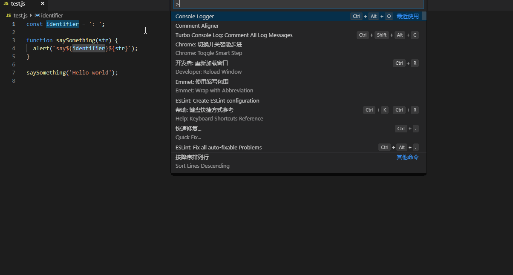

# comment-aligner README

## Features

A new extension for adding console code in your editor.

It is easy for coder to add console-info anywhere, and customised identifier is also allowed.

It will be like this:

## Requirements

None.

## Extension Settings

TODO.

## License

MIT.

## Resource code

https://github.com/gitshan/vscode-extension-console-logger.

## Release Notes

### 1.0.0

A new extension for adding console code in your editor.